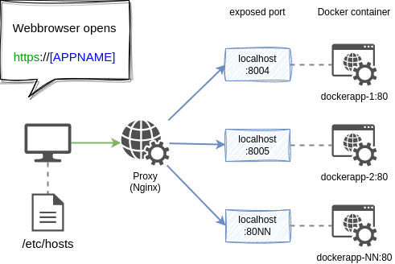
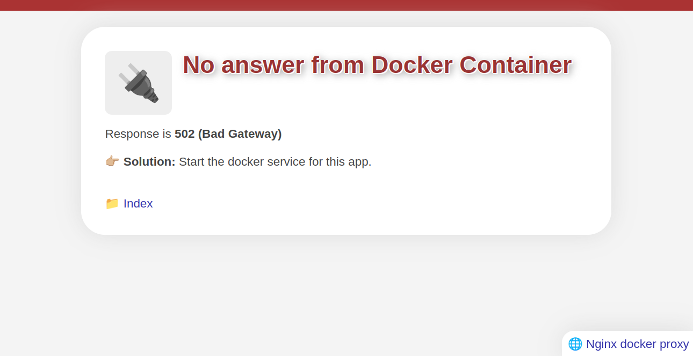
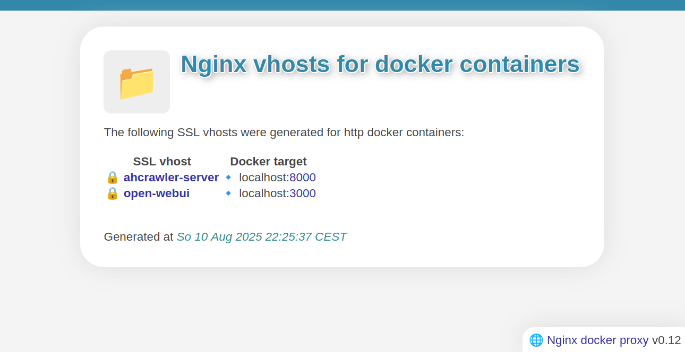

# Nginx proxy for multiple docker containers

A NGINX Docker proxy to access your dev docker containers 

* instead of ``http://localhost:PORT``
* with ``https://[APPNAME]``

Free software and open source.

👤 Author: Axel Hahn \
📄 Source: <https://github.com/axelhahn/nginx-docker-proxy> \
📜 License: GNU GPL 3.0 \
📗 Docs: see <https://www.axel-hahn.de/docs/nginx-docker-proxy>

---

The result of this tool is:

## Screenshots

If you didn't start a docker container yet, you can see a 502 error.

By starting the shell script a index page for all projects is created. You reach it when clicking on the "Index" link.

