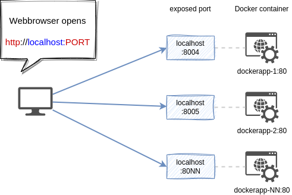

## Why

On my development computer I run multiple docker containers for different apps. I wanted to map the exposed ports of webapps in docker containers to readable hostnames.

The target group is a developer runnning docker for development on his/ her machine.

### Default way

If you run docker containers directly then you open `http://localhost:PORT`
For each app and need to remember the configured portnumbers.

### If using a proxy

The proxy translates `http(s)://[APPNAME]/` to `http://localhost:portnumber/` for a simpler access to a docker aoo. For each request it makes a backend request to the current container ports.

Remark: This is a proxy for your local access with a webbrowser only. It does not effect any docker internal access from one app to another.

The generator shellscript

* adds your wanted hostnames to /etc/conf and
* creates a self signed ssl certificate for each hostname
* creates a vhost config for nginx with a proxy rule to its docker container port